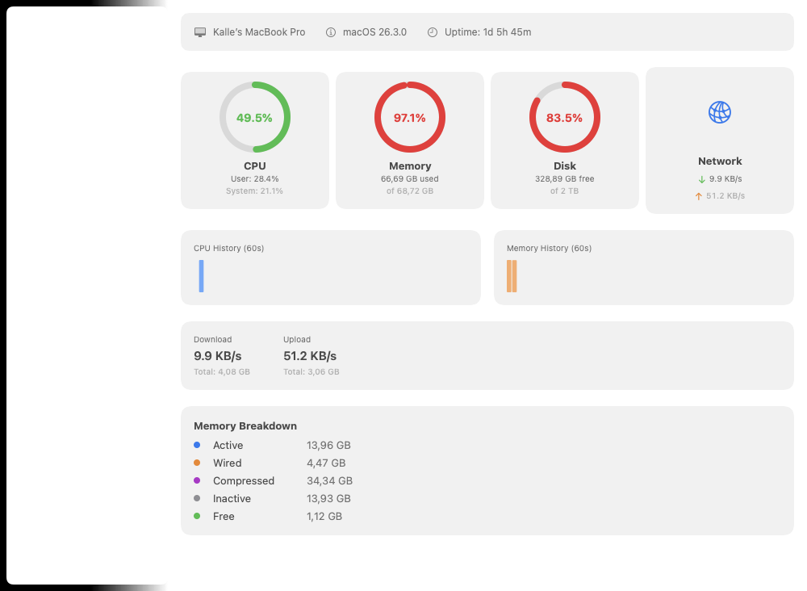
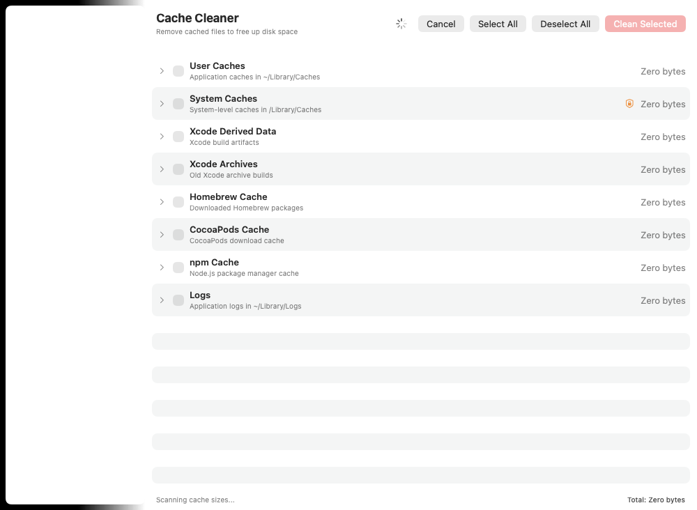
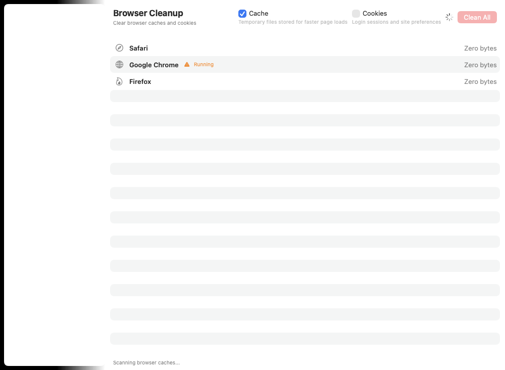
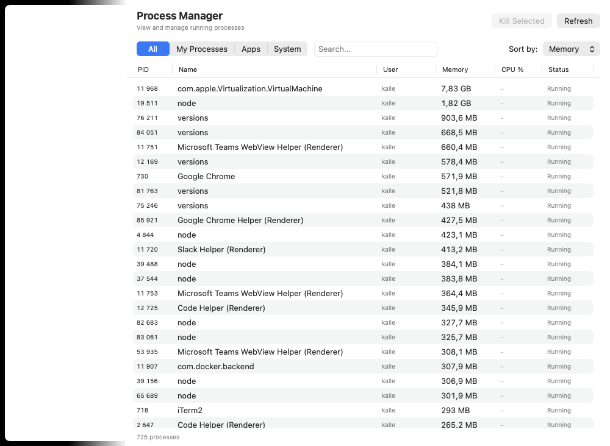
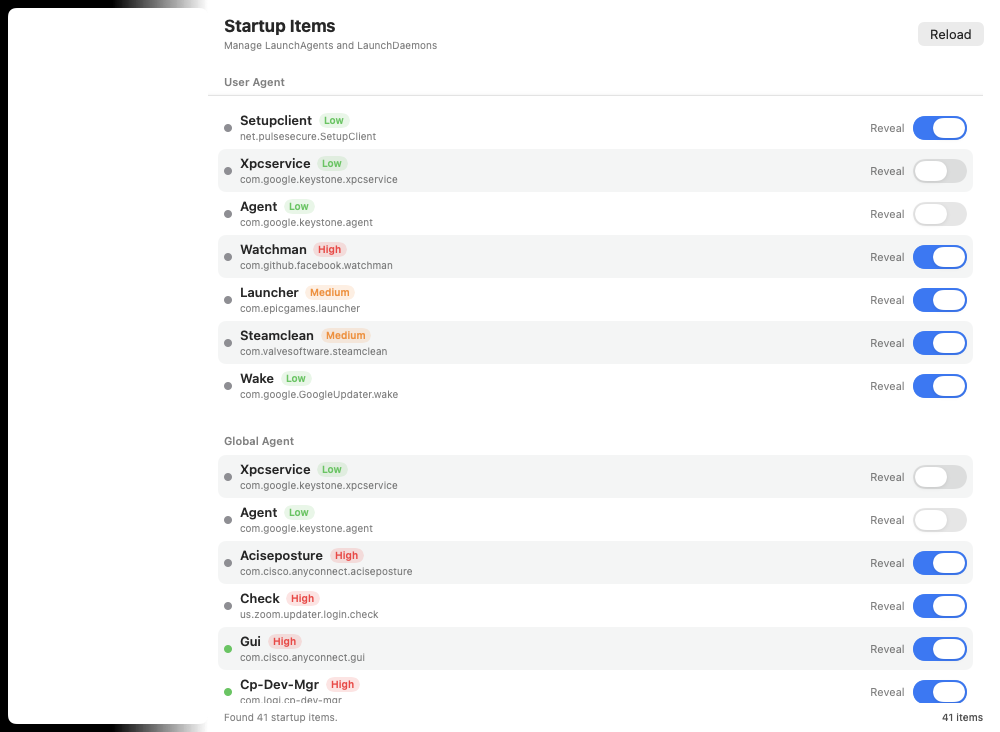
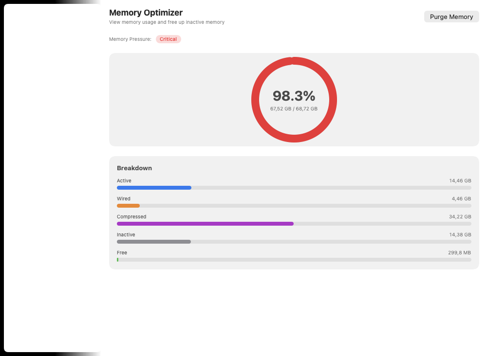

# Make My Mac Fast Again - User Stories

## 1. Dashboard - System Overview

**As a Mac user, I want to see my system's health at a glance, so that I can quickly identify performance bottlenecks.**

### Acceptance Criteria
- [ ] Real-time CPU gauge with user/system breakdown (updates every 2s)
- [ ] Memory gauge showing used/total with percentage
- [ ] Disk gauge showing used/free space with color coding (green <60%, yellow 60-80%, red >80%)
- [ ] Network throughput card showing download/upload speed + cumulative totals
- [ ] Memory breakdown showing Active, Wired, Compressed, Inactive, and Free
- [ ] System info bar: computer name, macOS version, uptime
- [ ] CPU and Memory sparkline history charts (last 60 seconds)

### Screenshot

---

## 2. Cache Cleaner - Free Disk Space

**As a Mac user, I want to find and remove cached files from my system, so that I can free up disk space without manually hunting through Library folders.**

### Acceptance Criteria
- [ ] Scan and display sizes for 8 cache categories:
  - User Caches (`~/Library/Caches`)
  - System Caches (`/Library/Caches`) - requires admin
  - Xcode Derived Data
  - Xcode Archives
  - Homebrew Cache
  - CocoaPods Cache
  - npm Cache
  - Application Logs (`~/Library/Logs`)
- [ ] Expandable detail view showing top 5 subdirectories per category
- [ ] Select All / Deselect All buttons for quick batch selection
- [ ] Cancel button to abort long-running scans
- [ ] Admin password prompt for system cache cleanup
- [ ] Before/after size comparison to show actual freed space
- [ ] Status bar showing total cache size and scan progress

### Screenshot

---

## 3. Browser Cleanup - Clear Browser Data

**As a Mac user, I want to clean browser caches and cookies for all my browsers at once, so that I don't have to open each browser's settings individually.**

### Acceptance Criteria
- [ ] Auto-detect installed browsers: Safari, Chrome, Firefox, Edge, Brave
- [ ] Separate toggles for Cache and Cookies cleanup
- [ ] Support for multiple Chrome/Edge/Brave profiles (not just "Default")
- [ ] Warning when a browser is currently running (data can't be cleaned while open)
- [ ] Cookie warning: clearing cookies will log you out of all websites
- [ ] Confirmation dialog before destructive cleanup
- [ ] Per-browser size display and total summary
- [ ] Status bar with cleanup progress

### Screenshot

---

## 4. Large File Finder - Reclaim Space

**As a Mac user, I want to find the largest files on my system, so that I can decide which ones to delete and reclaim significant disk space.**

### Acceptance Criteria
- [ ] Scan home directory for files above configurable threshold (50 MB / 100 MB / 500 MB / 1 GB)
- [ ] Results table with columns: Name, Size, Path, Modified Date, Reveal in Finder
- [ ] File type breakdown summary (Videos, Disk Images, Archives, Applications, Documents, Other)
- [ ] Multi-select files for batch "Move to Trash" operation
- [ ] Select All / Select None buttons for quick selection
- [ ] Cancel button to abort scan mid-way
- [ ] Confirmation dialog before moving files to Trash
- [ ] Progress indicator showing files scanned count
- [ ] Empty state with clear call-to-action when no scan has been run

### Screenshot

---

## 5. Process Manager - Monitor and Control Processes

**As a Mac user, I want to see which processes are using the most resources and kill unresponsive ones, so that I can free up CPU and memory without opening Activity Monitor.**

### Acceptance Criteria
- [ ] Sortable process table with columns: PID, Name, User, Memory, CPU %, Status
- [ ] Filter processes by category: All, My Processes, Apps, System
- [ ] Search bar to find processes by name, user, or PID
- [ ] Sort by: Memory (default), CPU, Name, PID
- [ ] Right-click context menu: Kill (SIGTERM), Force Kill (SIGKILL), Reveal in Activity Monitor
- [ ] "Kill Selected" button in header with confirmation dialog
- [ ] Native `kill()` syscall for process termination (no shell dependency)
- [ ] CPU percentage matches Activity Monitor (per-core, can exceed 100%)
- [ ] Auto-refresh every 3 seconds
- [ ] Status bar showing total process count

### Screenshot

---

## 6. Startup Items - Speed Up Boot Time

**As a Mac user, I want to see and control which programs start automatically when I log in, so that I can reduce boot time and background resource usage.**

### Acceptance Criteria
- [ ] List all LaunchAgents and LaunchDaemons (user + global)
- [ ] Grouped by type: User Agent, Global Agent, Global Daemon
- [ ] Running status indicator (green = running, gray = stopped)
- [ ] Impact level badge per item: High (red), Medium (orange), Low (green)
  - High: KeepAlive enabled
  - Medium: RunAtLoad enabled
  - Low: on-demand only
- [ ] Toggle switch to enable/disable each startup item
- [ ] "Reveal" button to show the plist file in Finder
- [ ] Admin password prompt for global items
- [ ] Reload button to refresh the list
- [ ] Status bar showing total item count

### Screenshot

---

## 7. Memory Optimizer - Free RAM

**As a Mac user, I want to free up inactive memory when my system feels slow, so that I can improve performance without restarting.**

### Acceptance Criteria
- [ ] Large memory gauge showing usage percentage with color coding
- [ ] Detailed memory breakdown: Active, Wired, Compressed, Inactive, Free (with bar charts)
- [ ] Memory pressure indicator badge: Normal (green), Warning (yellow), Critical (red)
- [ ] "Purge Memory" button that runs `/usr/sbin/purge` with admin authentication
- [ ] Before/after comparison card showing how much memory was freed
- [ ] Purge history log (last 10 purges with timestamps and freed amounts)
- [ ] Real-time updates every 2 seconds
- [ ] Memory calculation matches Activity Monitor (includes inactive pages)

### Screenshot

---

## 8. DNS Cache Flush - Fix Connectivity

**As a Mac user, I want to flush my DNS cache and diagnose DNS configuration, so that I can resolve connectivity issues without using Terminal commands.**

### Acceptance Criteria
- [ ] One-click "Flush DNS Cache" button (runs `killall -HUP mDNSResponder` with admin auth)
- [ ] Success/failure result display with clear visual feedback
- [ ] "When to Flush DNS" guidance section explaining common scenarios
- [ ] Current DNS Configuration display (parsed from `scutil --dns`)
  - Shows all resolvers with nameservers and domain assignments
- [ ] Suggested DNS Servers section (Cloudflare 1.1.1.1, Google 8.8.8.8, OpenDNS)
- [ ] "Test Servers" button measuring latency to all DNS servers via ping
  - Supports both IPv4 (ping) and IPv6 (ping6) servers
- [ ] Latency display per server (e.g., "12ms" or "timeout")
- [ ] Status bar showing last flush timestamp

### Screenshot

---

## Cross-Cutting User Stories

### Navigation

**As a Mac user, I want to quickly switch between features using keyboard shortcuts, so that I can work efficiently without reaching for the mouse.**

- Cmd+1 through Cmd+8 navigate to each feature
- Sidebar with grouped sections: Monitor (Dashboard), Cleanup (Cache, Browser, Large Files), System (Process Manager, Startup Items, Memory Optimizer, DNS Flush)

### Safety

**As a Mac user, I want confirmation dialogs before any destructive operation, so that I don't accidentally delete important files or kill critical processes.**

- All delete/clean/kill/purge operations show confirmation dialog
- Destructive buttons use red styling (`.destructive` role)
- Admin operations prompt for password via native macOS auth dialog

### Performance

**As a Mac user, I want the app to remain responsive during long operations, so that I can continue monitoring my system while scans are running.**

- File scans yield every 100 files for UI responsiveness
- All scans are cancellable mid-operation
- Progress indicators show current scan status
- Dashboard polling continues independently of other features
